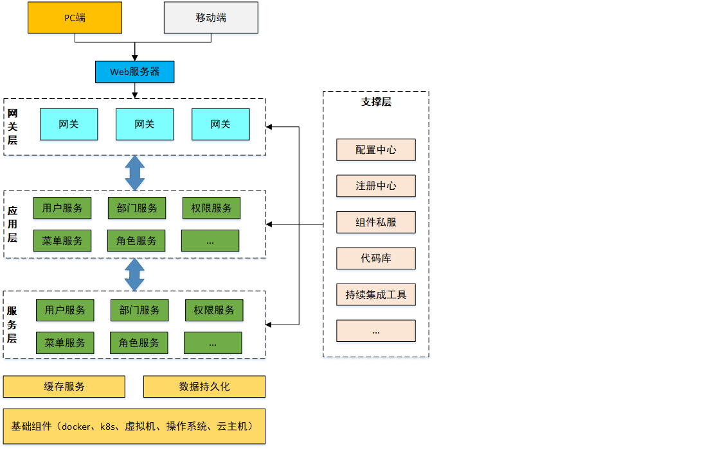

### 一、项目概述

对于企业中的项目绝大多数都需要进行用户权限管理、认证、鉴权、加密、解密、XSS防跨站攻击等。这些功能整体实现思路基本一致，但是大部分项目都需要实现一次，这无形中就形成了巨大的资源浪费。本项目就是针对这个问题，提供了一套通用的权限解决方案----品达通用权限系统。

品达通用权限系统基于SpringCloud(Hoxton.SR1)  +SpringBoot(2.2.2.RELEASE) 的微服务框架，具备通用的用户管理、资源权限管理、网关统一鉴权、XSS防跨站攻击等多个模块，支持多业务系统并行开发，支持多服务并行开发，可以作为后端服务的开发脚手架。核心技术采用SpringBoot、Zuul、Nacos、Fegin、Ribbon、Hystrix、JWT Token、Mybatis Plus等主要框架和中间件。

本项目具有两个主要功能特性：

- 用户权限管理

  具有用户、部门、岗位、角色、菜单管理，并通过网关进行统一的权限认证

- 微服务开发框架

  本项目同时也是一个微服务开发框架，集成了基础的公共组件，包括数据库、缓存、日志、表单验证、对象转换、防注入和接口文档管理等工具。

### 二、业务架构

### 三、技术架构

### 四、环境要求

- JDK ： 1.8 +
- Maven： 3.3 +
- Mysql： 5.6.0 +
- Redis： 4.0 +
- Nacos： 1.1.4
- Node： 11.3+（集成npm）

### 五、模块介绍

品达通用权限系统项目整体工程结构和模块功能如下：

~~~
pinda-authority              #聚合工程，用于聚合pd-parent、pd-apps、pd-tools等模块
├── pd-parent				 # 父工程，nacos配置及依赖包管理
├── pd-apps					 # 应用目录
	├── pd-auth				 # 权限服务父工程
		├── pd-auth-entity   # 权限实体
		├── pa-auth-server   # 权限服务
	├── pd-gateway			 # 网关服务
└── pd-tools				 # 工具工程
	├── pd-tools-common		 # 基础组件：基础配置类、函数、常量、统一异常处理、undertow服务器
	├── pd-tools-core		 # 核心组件：基础实体、返回对象、上下文、异常处理、分布式锁、函数、树
	├── pd-tools-databases	 # 数据源组件：数据源配置、数据权限、查询条件等
	├── pd-tools-dozer		 # 对象转换：dozer配置、工具
	├── pd-tools-j2cache	 # 缓存组件：j2cache、redis缓存
	├── pd-tools-jwt         # JWT组件：配置、属性、工具
	├── pd-tools-log	     # 日志组件：日志实体、事件、拦截器、工具
	├── pd-tools-swagger2	 # 文档组件：knife4j文档
	├── pd-tools-user        # 用户上下文：用户注解、模型和工具，当前登录用户信息注入模块
	├── pd-tools-validator	 # 表单验证： 后台表单规则验证
	├── pd-tools-xss		 # xss防注入组件
~~~

项目服务有两个：网关服务和权限服务。一个前端工程ui

| 应用           | 端口 | 说明     | 启动命令                       |
| -------------- | ---- | -------- | ------------------------------ |
| pd-gateway     | 8760 | 网关服务 | java -jar pd-gateway.jar &     |
| pd-auth-server | 8764 | 权限服务 | java -jar pd-auth-server.jar & |
| pd-authority-ui| 8080 | 前端工程 | npm run dev |

由于本系统是基于当前非常流行的前后端分离开发方式开发，其中前端部分是由专门的前端开发人员负责。